# Skip The Dishes - Delivery Scheduler
## Problem
Imagine if our customer could schedule a delivery for a specific place, date and time. This could be the beginning of recurring features like:

> I would like to schedule a dish every single Friday

> I would love to receive a surprise dish every Wednesday

> It would be great if I could receive a cheap and healthy food every day at home.

> I would love to surprise my wife every Wednesday with an exotic dish

The Return of Investment could be impressive because of the Monthly Recurring Revenue (MRR). This initiative could increase the customer engagement since you have customer consuming products like plans.

## Solution
The main idea is to create a service responsible for scheduling orders and surprise the customer with a Dish which is chosen as result of Kmeans Machine Learnig Algorithm. 

## Application in Production

1. [Application Running](http://ec2-18-231-72-5.sa-east-1.compute.amazonaws.com/)
2. [Sidekiq Running](http://ec2-18-231-72-5.sa-east-1.compute.amazonaws.com:3005/sidekiq)

## Kanban
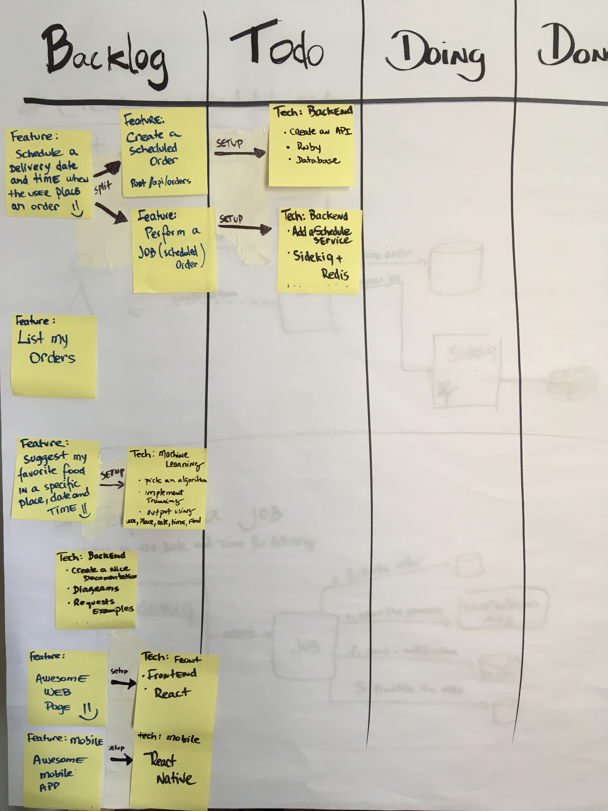

## Refinement and Architecture
### Create an order
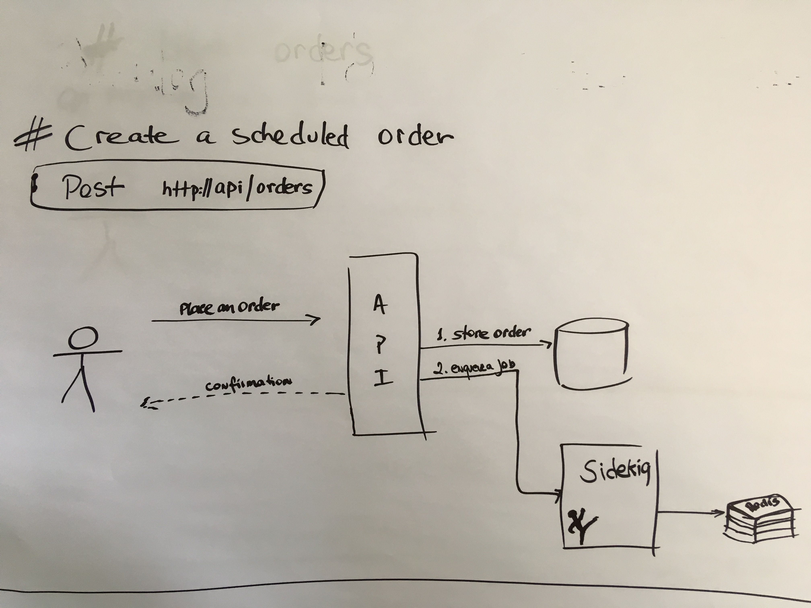

### Perform a Job
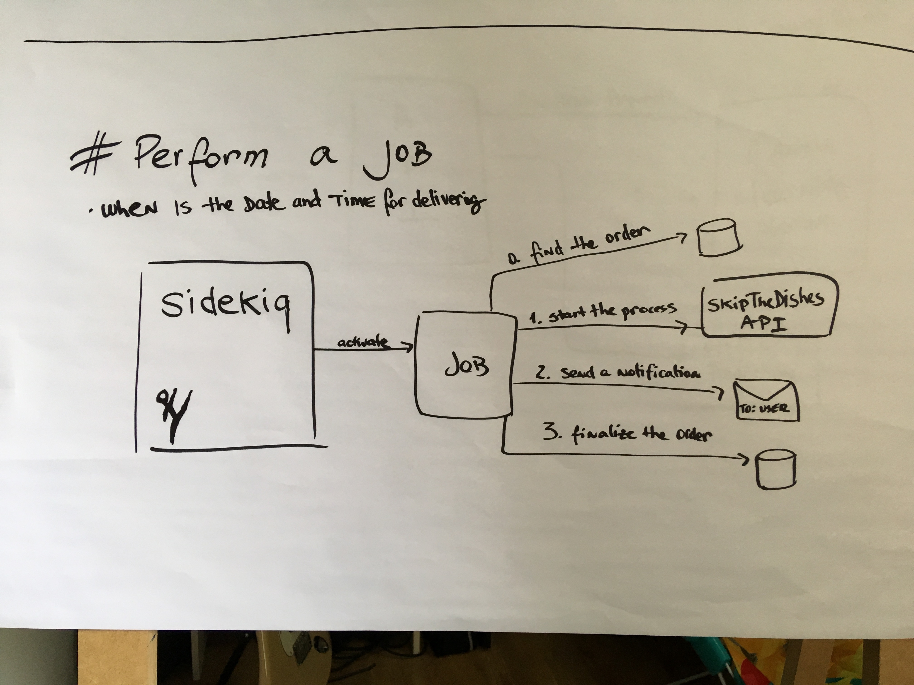

### List my Orders
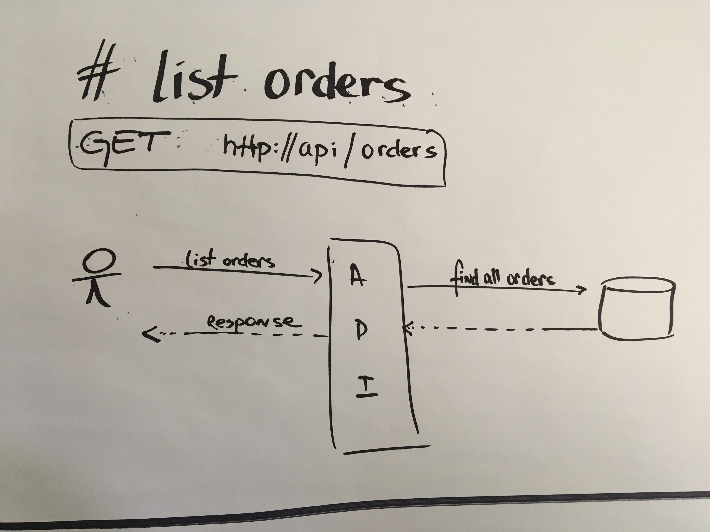

### Surprise me with delicious Food
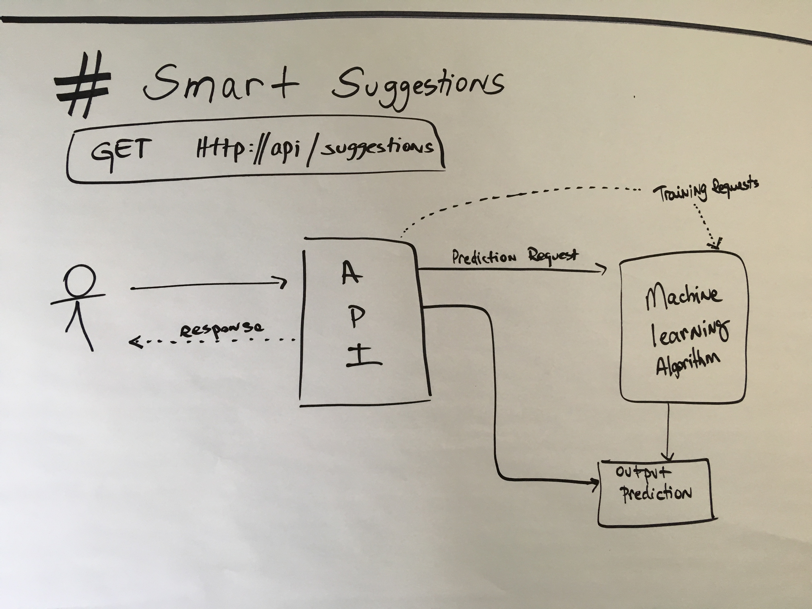

## Result

### Home
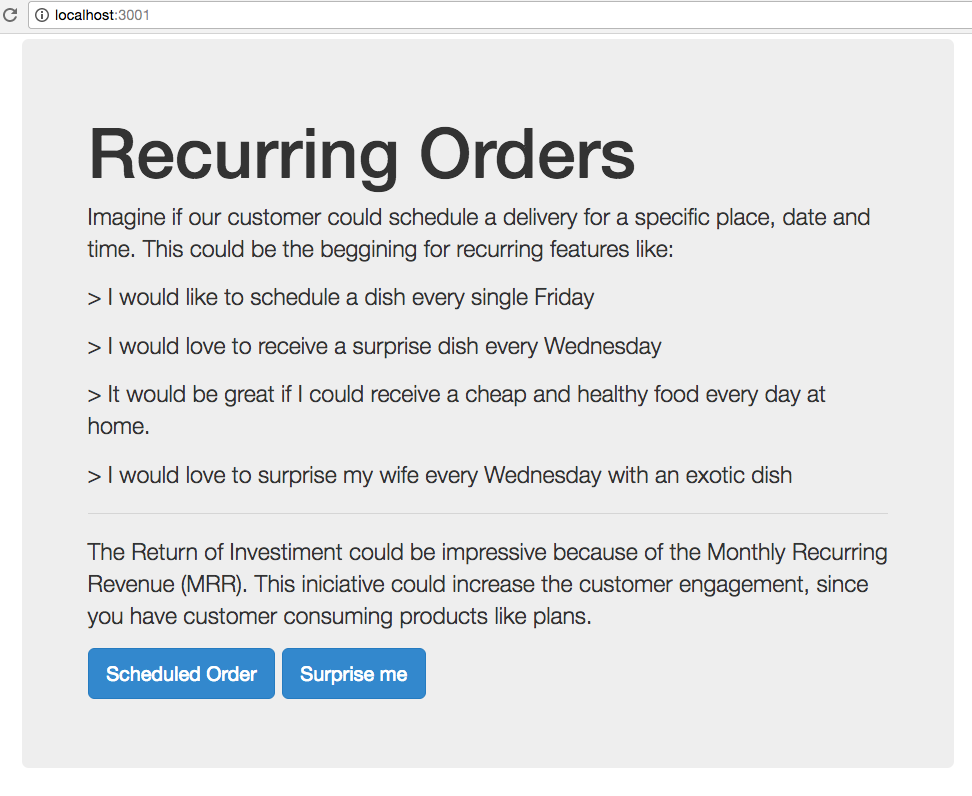

### Restaurants
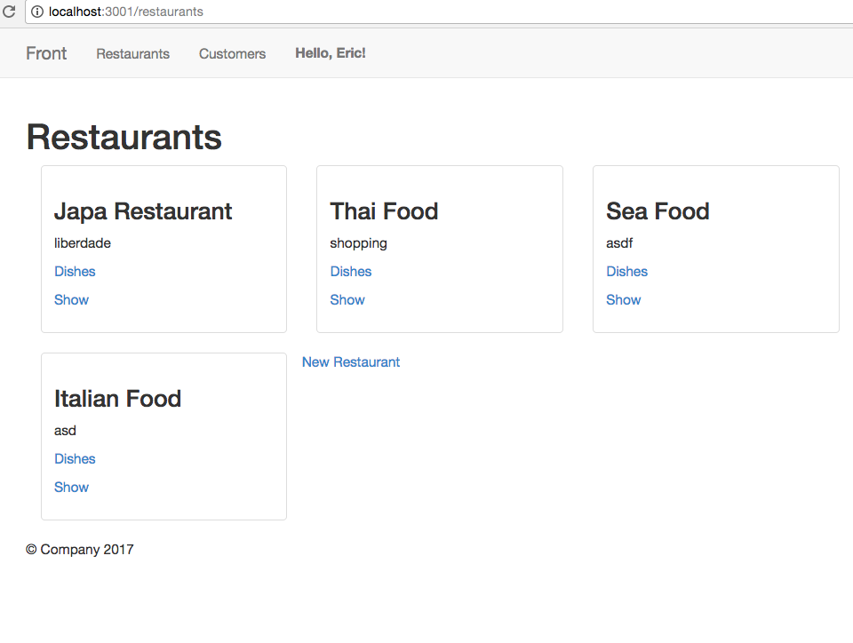

### Dishes
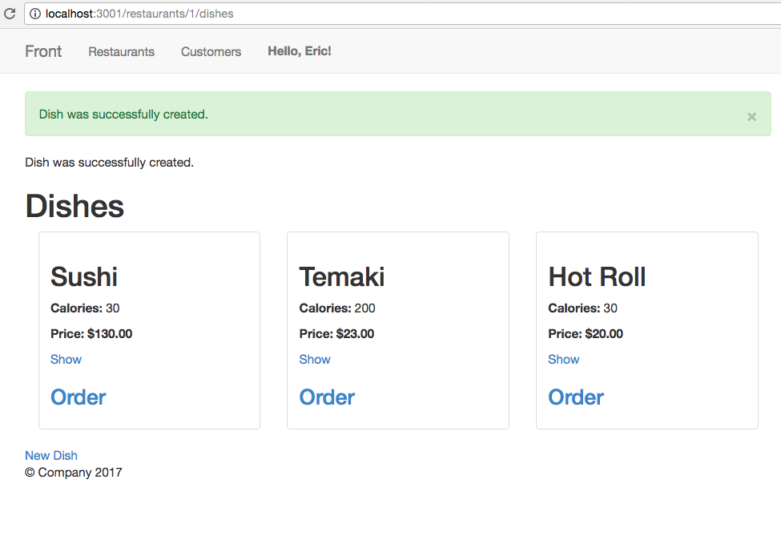

### Sidekiq
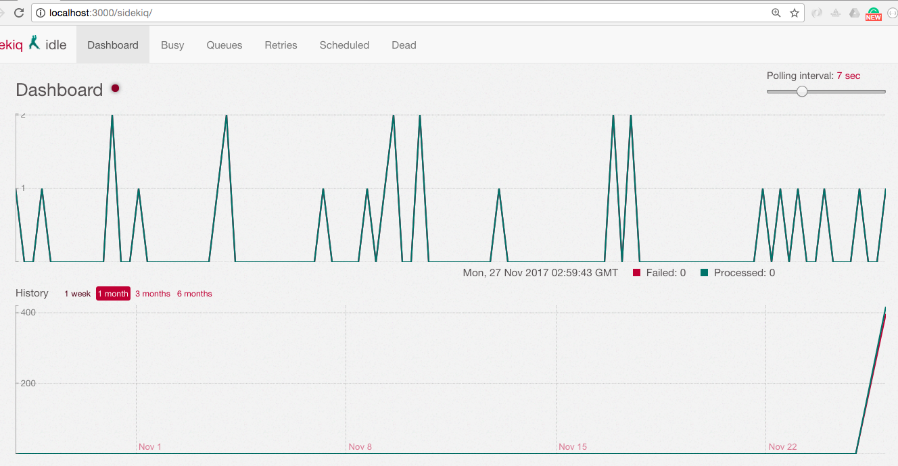

### Machine Learnig Algorithm to Offer a Surprise Dish
#### Clustering Process
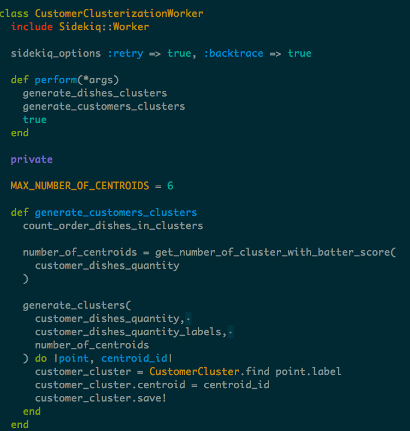
#### Feature
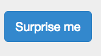
#### Using the algorithm output to suggest a Dish
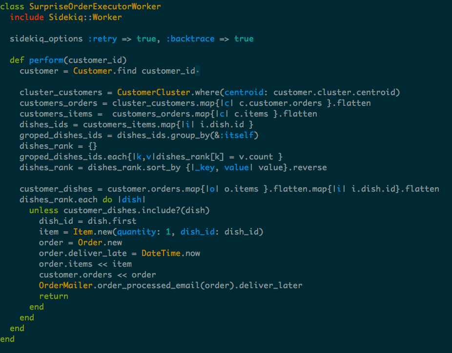

